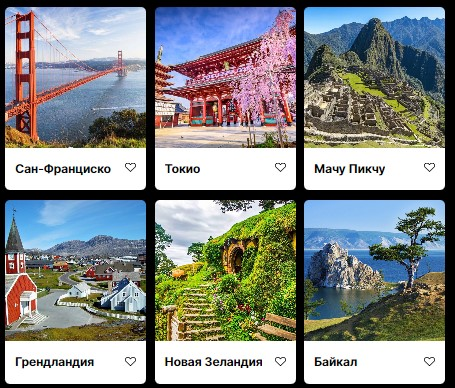
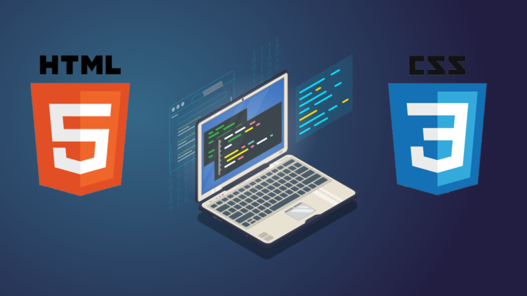

<h1 align="center"> Mesto Project </h1>

------

<h3> Третий практический проект курса <i>«Веб-разработчик плюс»</i></h3>
 

## Обзор
* Интро
* Figma
* Картинки
* Применяемые технологии
* Адрес проекта
* Планы на будущее
 
 

### Интро

Одностраничный, адаптивный сайт, который создан с использованием HTML, CSS.   
Файловая структура организована по БЭМ.
Блоки организованы по flex и grid. 
В проекте применяются формы, модификаторы и подключаемы шрифты.
 
 
### Figma

* [Ссылка на макет в Figma](https://www.figma.com/file/2cn9N9jSkmxD84oJik7xL7/JavaScript.-Sprint-4?node-id=28212%3A155&t=fjo1fJzOgZQX6e3e-1)
 
 

### **Картинки**

Картинки оптимизированы при помощи [ресурса](https://tinypng.com/), с использованием которого сайт будет загружаться быстрее.

 
 

### Применяемые технологии
 

* Grid
* Flexbox
* БЭМ
* Адаптивная вёрстка
* Сглаживание шрифтов
* Оптимизация картинок
* Использование форм и кнопок

 

### **Адрес проекта**

Проект расположен на [GitHub](https://si3el.github.io/mesto-project/index.html)

### **Планы**

Сделать сайт более интерактивным при помощи технологий JavaScript
